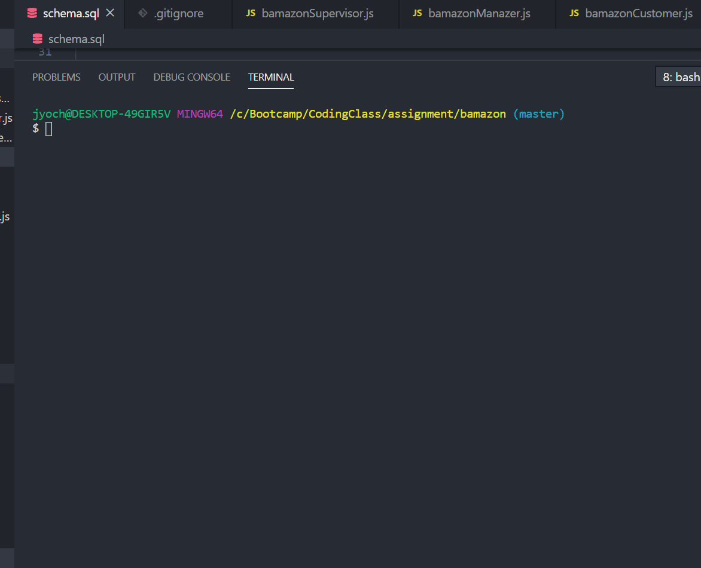
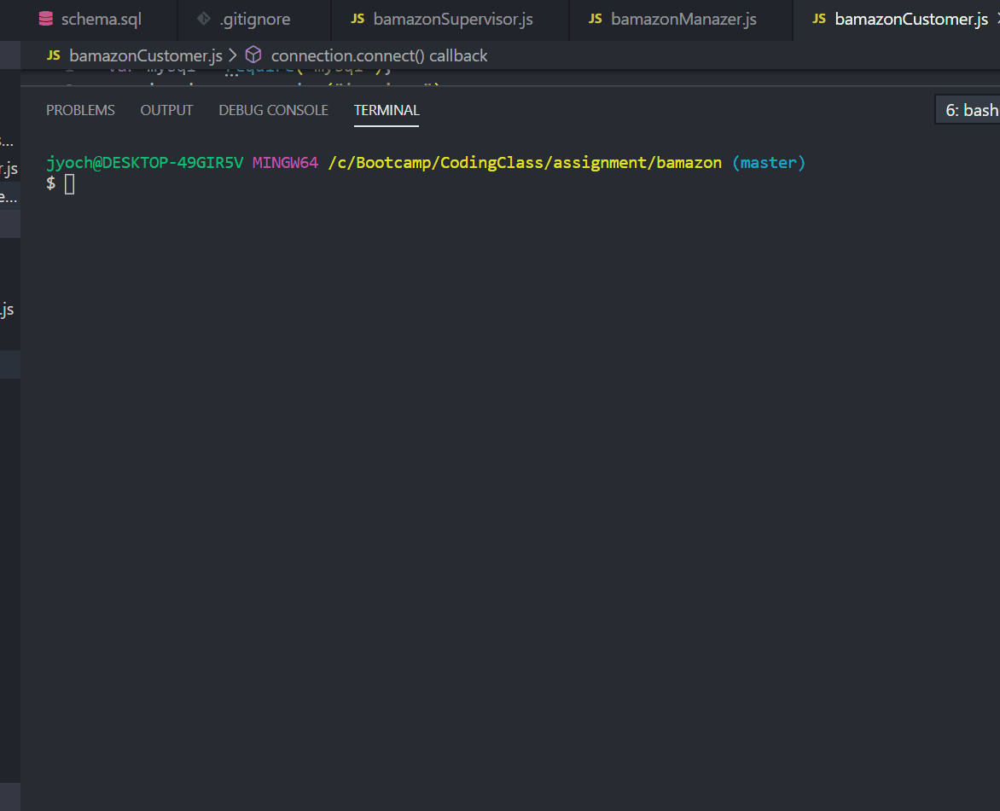

# Bamazon
 An amazon-like shopping app made with MYSQL and Node.JS which allow user to purchase item as a customer , view ,track and update the product inventory as a manager.

 # Bamazon Customer
 To run app: enter into command line "node bamazonCustomer.js"

 The Bamazon customer portak allows users to vies the current itmes available for purchase.
 

 # Bamazon Manager
  To run app: enter into command line "node bamazonManager.js"

  The Bamazon Customer Portal allows users to view and edit the inventory of the store. The user will be prompted to choose from the following options:

  

 

